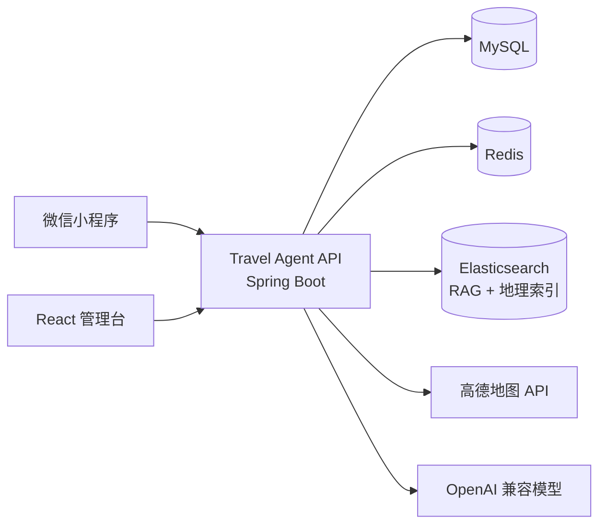

<div align="center">

# Travel Agent

### 让每一次出发，都有一位懂目的地的 AI 向导

面向旅行场景的智能助手与运营管理平台：在微信小程序中对话、规划行程、发现附近地点；在管理台维护景区、服务点与 RAG 知识库。

[](https://openjdk.org/)
[](https://spring.io/projects/spring-boot)
[](https://spring.io/projects/spring-ai)
[](https://react.dev/)
[](https://www.typescriptlang.org/)
[](https://www.mysql.com/)
[](https://redis.io/)
[](https://www.elastic.co/elasticsearch)
[](https://vite.dev/)
[](https://developers.weixin.qq.com/miniprogram/dev/framework/)
[](LICENSE)

<a href="https://openjdk.org/"></a>

**Java 21** · **Spring Boot 4** · **Spring AI** · **React 18** · **微信小程序** · **Elasticsearch**

[快速开始](#快速开始) · [系统架构](#系统架构) · [API 文档](#api-文档) · [项目结构](#项目结构)

</div>

## 项目简介

Travel Agent 将旅行问答、目的地知识和运营管理放进同一套系统：

| 使用者 | 能做什么 |
| --- | --- |
| 旅行者 | 微信授权登录、AI 旅行问答、会话历史、附近景点与服务推荐 |
| 运营人员 | 管理微信用户、会话、景区、服务点、地图地点与 Markdown 知识库 |

## 核心能力

- **上下文旅行对话**：基于 OpenAI 兼容模型生成旅行建议，支持多轮会话。
- **RAG 目的地知识**：景区文档写入 Elasticsearch 向量索引，为回答提供可检索的本地知识。
- **附近地点推荐**：结合用户位置与高德地图服务搜索周边景点和文旅服务。
- **运营管理台**：React + TypeScript 管理会话、景区、服务点和知识内容。
- **微信小程序入口**：原生 WXML / WXSS / JavaScript，完成登录、聊天和历史会话。
- **安全认证**：微信登录与管理端登录统一使用 JWT，刷新令牌存储在 Redis。

## 系统架构



## 技术栈

| 层次 | 技术 |
| --- | --- |
| Backend | Java 21、Spring Boot 4、Spring AI、Spring Security、MyBatis |
| Data | MySQL、Redis、Elasticsearch |
| Admin console | React 18、TypeScript、Vite、高德地图 JS API |
| Mini program | 原生 JavaScript、WXML、WXSS |
| API docs | Springdoc OpenAPI、NextDoc4j |

## 快速开始

### 环境要求

- JDK 21+
- Node.js 18+
- MySQL、Redis、Elasticsearch
- OpenAI 兼容模型服务 API Key
- 使用微信登录时，需要小程序 AppID / AppSecret；使用地图功能时，需要高德 Web 服务 Key

### 1. 配置并启动后端

复制示例配置：

```powershell
Copy-Item src/main/resources/application.example.yml src/main/resources/application.yml
```

在 `application.yml` 中填写数据库、Redis、模型服务、微信、高德地图和 Elasticsearch 配置。暂时不使用 RAG 时可关闭：

```powershell
$env:TRAVEL_AGENT_AGENT_RAG_ENABLED = "false"
```

启动 API：

```powershell
.\mvnw.cmd spring-boot:run
```

Linux / macOS：

```bash
./mvnw spring-boot:run
```

默认地址：`http://localhost:8080`

### 2. 启动管理台

```powershell
cd fe
Copy-Item .env.example .env
npm install
npm run dev
```

在 `fe/.env` 中设置 `VITE_API_BASE_URL=http://localhost:8080`。管理台默认地址：`http://localhost:5173`。

### 3. 导入微信小程序

1. 复制 `miniprogram/utils/config.example.js` 为 `config.js` 并填写后端地址。
2. 复制 `miniprogram/project.config.example.json` 为 `project.config.json` 并填写 AppID。
3. 使用微信开发者工具导入 `miniprogram/` 目录。

真机调试需要 HTTPS 地址，并在微信公众平台配置合法域名。

## API 文档

后端启动后访问：

- OpenAPI UI：`http://localhost:8080/doc.html`
- OpenAPI JSON：`http://localhost:8080/v3/api-docs`

主要接口分组：

| 分组 | 示例 |
| --- | --- |
| 认证 | `POST /api/auth/wx/login`、`POST /api/auth/admin/login`、`POST /api/auth/refresh` |
| AI 助手 | `POST /api/agent/chat`、`GET /api/agent/sessions`、`POST /api/agent/nearby/next` |
| 运营管理 | `/api/admin/scenic-spots`、`/api/admin/service-points`、`/api/admin/sessions` |
| 知识库 | `POST /api/admin/rag/scenic-documents` |

## 项目结构

```text
travel-agent/
├── src/                 Spring Boot API：认证、Agent、RAG、管理端
├── fe/                  React + TypeScript 管理台
├── miniprogram/         原生微信小程序
├── scripts/             部署与辅助脚本
├── pom.xml              Maven 构建配置
└── LICENSE              MIT License
```

## Docker 启动与部署

Docker Compose 会启动管理台、API、MySQL、Redis 和 Elasticsearch。首次启动需下载并构建镜像，网络较慢时请耐心等待，后续更新会复用镜像缓存。

```bash
git clone <仓库地址> travel-agent
cd travel-agent
cp .env.example .env
# 编辑 .env，填入数据库密码、模型 API Key、JWT 密钥及微信/高德配置
sudo sysctl -w vm.max_map_count=262144
docker compose up -d --build
```
RAG 默认已启用；如需显式设置，在 `.env` 中写：

```env
TRAVEL_AGENT_AGENT_RAG_ENABLED=true
```

查看状态和日志：

```bash
docker compose ps
docker compose logs -f
```

外网访问 `http://<服务器IP>/`，API 文档为 `http://<服务器IP>/doc.html`。安全组放行 `80` 端口。更新部署：

```bash
git pull
docker compose up -d --build
```

数据由 Docker volumes 持久化；不要执行 `docker compose down -v`，否则会删除 MySQL、Redis 与 Elasticsearch 数据。

## 开发与测试

运行后端测试：

```powershell
.\mvnw.cmd test
```

检查并构建管理台：

```powershell
cd fe
npm run check
npm run build
```

## 开源协议

[MIT](LICENSE) · 联系方式：`ndakjin@qq.com`
