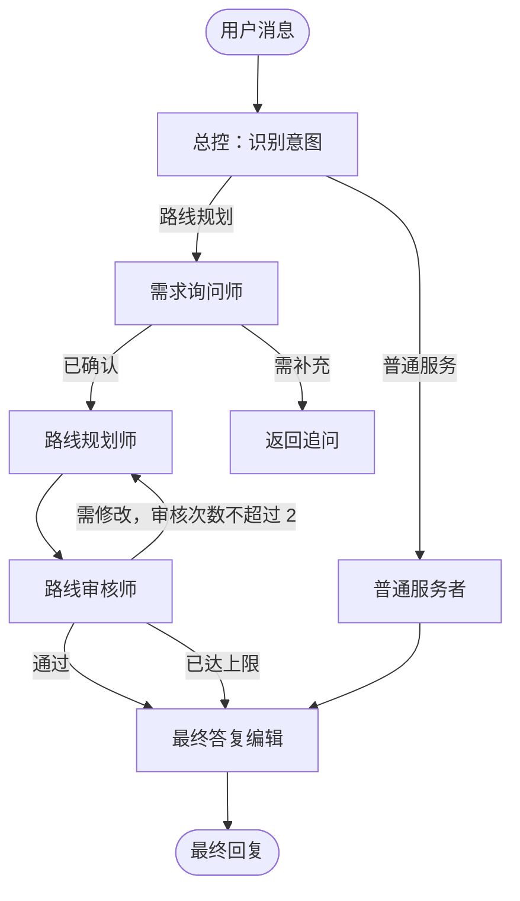

<div align="center">

# 行迹 AI 旅行助手

### 让每一次出发，都有一位懂目的地的 AI 向导

面向旅行场景的智能助手与运营管理平台：在微信小程序中对话、规划行程、发现附近地点；在管理台维护景区和服务点。

[](https://openjdk.org/)
[](https://spring.io/projects/spring-boot)
[](https://spring.io/projects/spring-ai)
[](https://react.dev/)
[](https://www.typescriptlang.org/)
[](https://www.mysql.com/)
[](https://redis.io/)
[](https://www.elastic.co/elasticsearch)
[](https://neo4j.com/)
[](https://vite.dev/)
[](https://developers.weixin.qq.com/miniprogram/dev/framework/)
[](LICENSE)

<a href="https://openjdk.org/"></a>

**Java 21** · **Spring Boot 4** · **Spring AI Alibaba** · **LangGraph4j** · **React 18** · **微信小程序** · **Elasticsearch**

[快速开始](#快速开始) · [系统架构](#系统架构) · [API 文档](#api-文档) · [项目结构](#项目结构)

</div>

## 项目简介

行迹 AI 旅行助手将旅行问答、目的地知识和运营管理放进同一套系统：

| 使用者 | 能做什么 |
| --- | --- |
| 旅行者 | 微信授权登录、AI 旅行问答、会话历史、附近景点与服务推荐 |
| 运营人员 | 管理微信用户、会话、景区、服务点、地图地点与 Markdown 知识库 |

## 核心能力

- **多智能体旅行对话**：LangGraph4j 编排意图识别、需求收集、路线规划、审核与最终答复；规划师可按需调用旅行知识、路线、POI 与预算专家。
- **附近地点推荐**：结合用户位置与高德地图服务搜索周边景点和文旅服务。
- **可选图谱能力**：Neo4j 启用后提供景点知识检索、城市归属与景点间最短路径；关闭时不影响基础对话和 POI 搜索。
- **运营管理台**：React + TypeScript 管理会话、景区、服务点和知识内容。
- **微信小程序入口**：原生 WXML / WXSS / JavaScript，完成登录、聊天和历史会话。
- **安全认证**：微信登录与管理端登录统一使用 JWT，刷新令牌存储在 Redis。

## 系统架构

```mermaid
flowchart LR
    mini[微信小程序]
    admin[React 管理台]
    api[行迹 API<br/>Spring Boot]
    graph[LangGraph4j 编排]
    supervisor[总控]
    requirements[需求询问师]
    planner[路线规划师]
    reviewer[路线审核师]
    normal[普通服务者]
    finalize[最终答复编辑]
    knowledge[旅行知识专员]
    route[路线规划专员]
    poi[POI 搜索专员]
    budget[预算专员]
    mysql[(MySQL)]
    redis[(Redis)]
    es[(Elasticsearch<br/>地理索引)]
    neo4j[(Neo4j<br/>图关系)]
    amap[高德地图 API]
    model[OpenAI 兼容模型]

    mini --> api
    admin --> api
    api --> graph
    graph --> supervisor
    supervisor --> requirements
    requirements --> planner
    planner --> reviewer
    supervisor --> normal
    reviewer --> finalize
    normal --> finalize
    planner -.按需调用.-> knowledge
    planner -.按需调用.-> route
    planner -.按需调用.-> poi
    planner -.按需调用.-> budget
    normal -.按需调用.-> knowledge
    normal -.按需调用.-> route
    normal -.按需调用.-> poi
    normal -.按需调用.-> budget
    api --> mysql
    api --> redis
    api --> es
    api --> neo4j
    api --> amap
    api --> model
```

## 多智能体协作

主流程由 **LangGraph4j** 管理，专家能力仍通过 **Spring AI Tool Calling** 接入。总控只做意图判断；路线规划师和普通服务者按需调用专家，专家结果以 Markdown 列表返回上层模型。



路线需求的必填项为起点、终点、出行日期或天数、人数与预算；兴趣和约束为选填项，用户未提供时不阻塞规划。

| 角色 | 工具与职责 | 启用条件 |
| --- | --- | --- |
| 总控 | 判断路线规划或普通服务 | 始终启用 |
| 路线需求询问师 | 收集并确认路线规划的必填需求 | 路线规划 |
| 路线规划师 | 制定行程，按需调用四位专家 | 路线规划 |
| 路线审核师 | 审核行程；最多要求修改两次 | 路线规划 |
| 普通服务者 | 直接处理非路线规划问题，按需调用四位专家 | 普通服务 |
| 最终答复编辑 | 将已完成结果整理为面向用户的自然回复 | 始终启用 |
| 旅行知识规划专员 | 查询 Neo4j 景点、城市和兴趣知识 | `TRAVEL_AGENT_NEO4J_ENABLED=true` |
| 路线规划专员 | 查询 `CONNECTED_TO` 与景点最短路径 | `TRAVEL_AGENT_NEO4J_ENABLED=true` |
| POI 搜索专员 | 查询附近景点、餐厅、酒店和便民服务 | 始终启用 |
| 预算专员 | 汇总已知门票、住宿、餐饮与交通费用；缺失价格标记待确认 | 始终启用 |

四位专家统一返回紧凑的 Markdown 列表，供路线规划师或普通服务者直接综合。例如路线专家：

```text
结论：已找到路线
- 路线：起点 ID → 途经景点 → 终点 ID｜累计距离｜跳数
```

提示词位于 `src/main/resources/prompt/`，统一使用“角色、输入、输出、约束”结构。

## 技术栈

| 层次 | 技术 |
| --- | --- |
| Backend | Java 21、Spring Boot 4、Spring AI Alibaba、LangGraph4j、Spring Security、MyBatis |
| Data | MySQL、Redis、Elasticsearch、Neo4j |
| Admin console | React 18、TypeScript、Vite、高德地图 JS API |
| Mini program | 原生 JavaScript、WXML、WXSS |
| API docs | Springdoc OpenAPI、NextDoc4j |

## 快速开始

### 环境要求

- JDK 21+
- Node.js 18+
- MySQL、Redis，以及可访问的 Elasticsearch
- 可选：Neo4j（启用旅行知识与路线专员时需要）
- 阿里云百炼 DashScope API Key
- 使用微信登录时，需要小程序 AppID / AppSecret；使用地图功能时，需要高德 Web 服务 Key

### 1. 配置并启动后端

复制示例配置：

```powershell
Copy-Item src/main/resources/application.example.yml src/main/resources/application.yml
```

在 `application.yml` 中填写数据库、Redis、模型服务、微信、高德地图和 Elasticsearch 配置。Neo4j 默认关闭；需要图谱能力时设置：

```yaml
travel-agent:
  neo4j:
    enabled: true
```

启动 API：

```powershell
.\mvnw.cmd spring-boot:run
```

Linux / macOS：

```bash
./mvnw spring-boot:run
```

默认地址：`http://localhost:8080`

### 2. 启动管理台

```powershell
cd fe
Copy-Item .env.example .env
npm install
npm run dev
```

在 `fe/.env` 中设置 `VITE_API_BASE_URL=http://localhost:8080`。管理台默认地址：`http://localhost:5173`。

### 3. 导入微信小程序

1. 复制 `miniprogram/utils/config.example.js` 为 `config.js` 并填写后端地址。
2. 复制 `miniprogram/project.config.example.json` 为 `project.config.json` 并填写 AppID。
3. 使用微信开发者工具导入 `miniprogram/` 目录。

真机调试需要 HTTPS 地址，并在微信公众平台配置合法域名。

## API 文档

后端启动后访问：

- OpenAPI UI：`http://localhost:8080/doc.html`
- OpenAPI JSON：`http://localhost:8080/v3/api-docs`

主要接口分组：

| 分组 | 示例 |
| --- | --- |
| 认证 | `POST /api/auth/wx/login`、`POST /api/auth/admin/login`、`POST /api/auth/refresh` |
| AI 助手 | `POST /api/agent/chat`、`GET /api/agent/sessions`、`POST /api/agent/nearby/next` |
| 运营管理 | `/api/admin/scenic-spots`、`/api/admin/service-points`、`/api/admin/sessions` |

## 项目结构

```text
travel-agent/
├── src/                 Spring Boot API：认证、Agent、管理端
├── fe/                  React + TypeScript 管理台
├── miniprogram/         原生微信小程序
├── scripts/             部署与辅助脚本
├── pom.xml              Maven 构建配置
└── LICENSE              MIT License
```

## Docker 启动与部署

Docker Compose 会启动管理台、API、MySQL 和 Redis。Elasticsearch 与 Neo4j 可部署在独立服务器，通过 `.env` 中的公网地址连接。

```bash
git clone <仓库地址> travel-agent
cd travel-agent
cp .env.example .env
# 编辑 .env，填入数据库密码、模型 API Key、JWT 密钥、微信/高德与 Elasticsearch 配置
# 图谱默认关闭；需要启用时设置 TRAVEL_AGENT_NEO4J_ENABLED=true
docker compose up -d --build
```

```env
TRAVEL_AGENT_AGENT_ELASTICSEARCH_HOST=<ES 公网地址>
TRAVEL_AGENT_NEO4J_ENABLED=false
# 仅启用图谱时需要：
SPRING_NEO4J_URI=bolt://<Neo4j 公网地址>:7687
NEO4J_PASSWORD=<Neo4j 密码>
```

查看状态和日志：

```bash
docker compose ps
docker compose logs -f
```

外网访问 `http://<服务器IP>/`，API 文档为 `http://<服务器IP>/doc.html`。安全组放行 `80` 端口。更新部署：

```bash
git pull
docker compose up -d --build
```

数据由 Docker volumes 持久化；不要执行 `docker compose down -v`，否则会删除 MySQL 与 Redis 数据。

## 开发与测试

运行后端测试：

```powershell
.\mvnw.cmd test
```

检查并构建管理台：

```powershell
cd fe
npm run check
npm run build
```

## 开源协议

[MIT](LICENSE) · 联系方式：`ndakjin@qq.com`
