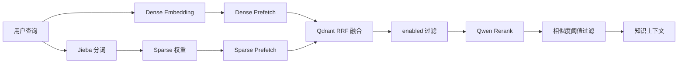
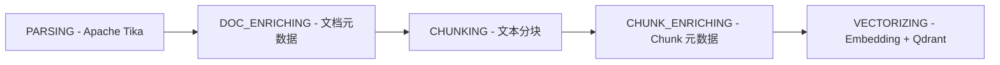

<div align="center">

# 行迹 AI 旅行助手

### 让每一次出发，都有一位懂目的地的 AI 向导

面向旅行场景的多智能体助手：通过自然语言完成旅行问答、需求澄清和个性化行程规划。

[](https://openjdk.org/)
[](https://spring.io/projects/spring-boot)
[](https://spring.io/projects/spring-ai)
[](https://react.dev/)
[](https://www.typescriptlang.org/)
[](https://www.mysql.com/)
[](https://redis.io/)
[](https://kafka.apache.org/)
[](https://vite.dev/)
[](https://developers.weixin.qq.com/miniprogram/dev/framework/)
[](LICENSE)

<a href="https://openjdk.org/"></a>

**Java 21** · **Spring Boot 4** · **Spring AI Alibaba** · **LangGraph4j**

[快速开始](#快速开始) · [系统架构](#系统架构) · [API 文档](#api-文档)

</div>

## 项目简介

行迹 AI 旅行助手面向旅行问答与路线规划，使用 LangGraph4j 编排状态驱动的多智能体协作，让不同专家共同完成需求澄清、行程规划、预算核算和结果审核。

- **多智能体意图路由**：由总控 Agent 识别用户意图并写入工作流状态；普通旅行问答直接进入普通服务链路，路线规划请求进入“需求确认—路线规划—路线审核—最终答复”流程，避免无关请求进入复杂规划链路。
- **语义缓存加速**：需求确认完成后，将结构化旅行需求写入 Redis Stack 的 HNSW 向量索引并进行相似度匹配，同时校验起点、终点、日期等必填条件；命中相近需求时复用历史路线方案，减少重复模型调用，且缓存仅在路线审核通过后写入并设置 24 小时 TTL。
- **旅行规划与审核回流**：路线规划师根据确认后的需求生成行程，路线审核师从需求匹配度、行程完整性和可执行性等维度输出结构化审核结果；审核不通过时将问题回流至规划师重新生成，领域规则限制最多两轮修订，形成受控的“规划—审核—修订”闭环。
- **RAG 检索与重排**：基于 Apache Tika 完成多格式文档解析、元数据提取和文本分块，使用 Qdrant 按相似度阈值召回候选 Chunk，再由 Qwen Rerank 对候选内容进行二次排序和截断；最终上下文同时保留正文、文档与 Chunk 元数据以及向量分数和重排分数，提升景点、城市和路线知识的召回准确性与可追溯性。
- **动态上下文注入与并发协作**：根据当前流程阶段组装需求、规划、审核等结构化上下文，避免每轮重复传递完整历史；路线规划师按需生成多个专家任务，对同一专家去重后通过 `CompletableFuture.allOf` 和自定义线程池并发调用旅行知识、路线和预算专家，再统一汇总结果，降低整体规划耗时。
- **分层上下文压缩设计**：MySQL 永久保存完整会话原文，模型侧按 token 预算加载历史摘要和最近对话；上下文接近预算时触发增量摘要，保留已确认需求、用户偏好、关键决策和待办问题，避免长会话无限膨胀。

### 上下文压缩管理

会话上下文规划采用“完整原文 + 增量摘要 + 最近消息”的分层策略（当前代码已落地 token 预算裁剪，摘要持久化链路待继续接入）：


摘要仅压缩发送给模型的上下文，不删除数据库中的原始消息，并为系统提示词、工具调用、RAG 结果和模型输出预留空间。

不同工作流节点按需接收上下文：监督和需求收集使用摘要与近期对话，路线规划和审核主要使用结构化需求、路线方案及审核结果，从源头减少重复传递。

## 系统架构


## 多智能体协作


## 语义缓存

### 为什么需要语义缓存

路线规划不是简单的数据库查询。一次请求通常要经过需求确认、知识检索、路线规划、预算核算、路线审核和最终整理，会产生多次 Embedding、向量检索和大模型调用。不同用户的表达可能不同，但实际需求高度相似，例如“周末带孩子去南京玩两天”和“南京亲子两日游”往往可以复用相近的路线方案。

如果每次都从头规划，会带来更高的模型费用、更长的响应时间，也会让相同需求在不同时间得到不一致的结果。语义缓存通过“相似需求复用已审核方案”降低这类重复计算。

### 语义缓存解决了什么问题

- **降低响应延迟**：命中缓存时，不需要重新执行完整的路线规划和专家协作流程。
- **减少模型调用成本**：避免对相同或近似需求重复调用路线、知识和预算专家。
- **提升结果稳定性**：相似请求可以复用已经审核通过的可执行方案。
- **避免错误复用**：缓存不是简单的关键词匹配，还会校验相似度和起点、终点、日期、天数、人数、预算等关键条件。
- **控制缓存有效期**：路线、价格和景点信息会变化，缓存通过 TTL 自动过期，避免长期使用旧方案。

语义缓存只用于路线规划，不缓存普通闲聊或普通知识问答，也不会写入尚未通过路线审核的结果。

### 项目中的实现

项目在路线需求确认完成后查询 Redis 语义缓存，判断是否存在足够相似且条件匹配的历史路线。命中后直接复用已审核的路线方案；未命中时继续执行正常的路线规划流程。

## RAG 知识库

RAG 模块独立于 LangGraph 编排层，负责知识文档的导入、加工、向量化、检索和运营管理。路线规划师与普通服务者通过 Spring AI Tool 按需调用旅行知识专家；Qdrant 召回候选 Chunk 后直接交由 Qwen Rerank 重排并筛选最终结果，最后将结构化知识上下文交给上层 Agent。

Redis 语义缓存与 Qdrant RAG 分工明确：Redis 只保存已审核的路线方案，利用内存查询和 TTL 快速复用相似需求；Qdrant 保存知识库 Chunk，支持较大规模的向量召回、过滤和持久化。两者不互相替代。

### RAG 检索设计优势

采用“向量召回 + 语义重排”的两阶段设计，可以先利用 Qdrant 快速筛出较大的候选集合，再由 Qwen Rerank 对候选内容进行精细相关性判断。这样既保留了向量检索的速度和扩展性，又能减少仅依赖向量距离带来的误召回，提升最终注入上下文的准确性。

召回和重排职责分离，便于独立替换存储或模型，也能根据数据规模和调用成本调整检索策略。结果同时保留正文、文档元数据、Chunk 元数据以及两阶段评分，方便生成答案和后续问题定位。

### 混合检索架构

项目使用 Qdrant 原生的双路混合检索，将语义检索和词法检索结合起来：



#### Dense 检索

Dense 路使用 DashScope Embedding 模型将查询和知识库 Chunk 转换为稠密向量，并在 Qdrant 的 `dense` 向量空间中进行 Cosine 相似度召回。它擅长识别同义表达和语义相关内容，例如“带孩子去南京玩两天”和“南京亲子两日游”。

#### Sparse 检索

Sparse 路使用 Jieba 对中文文本进行分词，并根据词频计算 BM25 风格的 TF 权重，再写入 Qdrant 的 `sparse` 向量空间。Qdrant collection 为 sparse 向量配置了 `idf` modifier，用于结合索引中的词项分布计算 IDF。

当前 sparse encoder 使用稳定的 token hash 作为稀疏维度，属于轻量的中文词法检索实现；后续如果更换 tokenizer、词典或维度映射，需要对已有 Chunk 重新生成 sparse 向量并重新索引。

#### Qdrant `prefetch + RRF`

查询时分别执行 dense 和 sparse 两路 `prefetch`，每路先召回 `recall-top-k` 个候选，然后由 Qdrant 使用 Reciprocal Rank Fusion（RRF）按候选排名进行融合。RRF 不直接比较两种向量分数的绝对值，因此能够避免 dense 和 sparse 分数尺度不同带来的权重偏差。

两路召回都会应用 `enabled = true` 过滤条件，已禁用的文档或 Chunk 不会进入候选集。融合后的结果保留 Qdrant 返回的 RRF score，供后续观测和问题定位使用。

#### Rerank 与最终阈值

RRF 结果只负责高效召回候选，最终相关性由 Qwen Rerank 对查询和候选 Chunk 进行二次判断。系统先按 rerank 结果排序，再使用 `similarity-threshold` 过滤，最后截取 `top-k` 条内容注入 Agent 上下文。

因此，当前的分数含义如下：

| 分数 | 含义 | 用途 |
| --- | --- | --- |
| Dense score | 稠密向量相似度 | 单路召回 |
| Sparse score | 词法稀疏向量相似度 | 单路召回 |
| RRF score | 两路候选排名融合分数 | 混合排序 |
| Rerank score | Qwen 对查询和 Chunk 的相关性判断 | 最终过滤 |

`similarity-threshold` 作用于 Rerank score，而不是 Qdrant 的 RRF score。这样可以先扩大召回范围，再由重排模型控制最终注入上下文的质量。

RAG 工具结果使用 Redis 做精确查询缓存，默认 TTL 为 2 分钟（可通过 `TRAVEL_AGENT_RAG_CACHE_TTL` 调整）。知识库或 Chunk 变更时不主动删除缓存，允许在 TTL 窗口内短暂返回旧结果，以减少批量变更时的缓存扫描和删除开销。

### RAG 文档导入流水线

导入接口只负责接收文件、保存任务和发送 Kafka 消息，不等待完整处理。Kafka 消费者使用固定顺序的节点流水线执行：



先解析文档，再补充文档元数据、切分文本、补充 Chunk 元数据，最后生成向量并写入 Qdrant。

这种设计让文件上传与耗时的解析、向量化解耦，接口可以快速返回，避免大文件处理阻塞请求。Kafka 提供任务缓冲和失败重试能力，固定顺序的节点也让每个阶段职责清晰、便于定位问题；任务状态和消息 outbox 持久化后，即使服务重启也能继续处理，降低数据丢失风险。

## 快速开始

Docker Compose 会启动管理台、API、MySQL、Redis、Qdrant 和单节点 Kafka（KRaft）。

```bash
git clone <仓库地址> travel-agent
cd travel-agent
cp .env.example .env
# 编辑 .env，填入必填配置
docker compose up -d --build
```

查看状态和日志：

```bash
docker compose ps
docker compose logs -f
```

管理台地址：`localhost:8081`，API 地址：`localhost:18080`。

更新部署：

```bash
git pull
docker compose up -d --build
```

数据由 Docker volumes 持久化；不要执行 `docker compose down -v`，否则会删除 MySQL、Kafka、Qdrant 和 Redis 数据。

## API 文档

后端启动后访问：

`localhost:18080/doc.html`


文档访问密码：`123456`

## 快速体验

[用户侧 Agent 网页端示例](http://agent.ndakjin.asia/)

[接口文档展示入口](http://admin.ndakjin.asia/doc.html)

## 开源协议

[MIT](LICENSE) · 联系方式：`ndakjin@qq.com`


