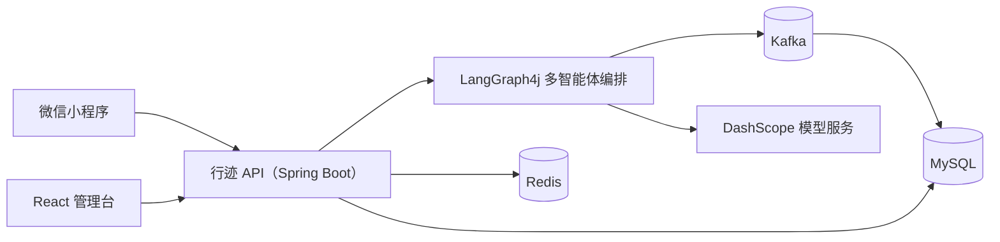

<div align="center">

# 行迹 AI 旅行助手

### 让每一次出发，都有一位懂目的地的 AI 向导

面向旅行场景的智能助手与运营管理平台：在微信小程序中对话、规划行程；在管理台查看会话与 Agent 调用记录。

[](https://openjdk.org/)
[](https://spring.io/projects/spring-boot)
[](https://spring.io/projects/spring-ai)
[](https://react.dev/)
[](https://www.typescriptlang.org/)
[](https://www.mysql.com/)
[](https://redis.io/)
[](https://kafka.apache.org/)
[](https://vite.dev/)
[](https://developers.weixin.qq.com/miniprogram/dev/framework/)
[](LICENSE)

<a href="https://openjdk.org/"></a>

**Java 21** · **Spring Boot 4** · **Spring AI Alibaba** · **LangGraph4j** · **React 18** · **微信小程序**

[快速开始](#快速开始) · [系统架构](#系统架构) · [API 文档](#api-文档) · [项目结构](#项目结构)

</div>

## 项目简介

行迹 AI 旅行助手将旅行问答、路线规划和运营管理放进同一套系统：

| 使用者 | 能做什么 |
| --- | --- |
| 旅行者 | 微信授权登录、AI 旅行问答、个性化行程规划、会话历史 |
| 运营人员 | 管理微信用户、查看会话与 Agent 调用观测日志 |

## 核心能力

- **多智能体旅行对话**：LangGraph4j 编排意图识别、需求收集、路线规划、审核与最终答复；规划师可按需调用旅行知识、路线与预算专家。
- **对话状态持久化**：LangGraph4j Checkpoint 使用 RedisSaver 保存 Human-in-the-loop 状态，Checkpoint 自动保留 7 天。
- **旅行知识 RAG**：旅行知识专家通过 Spring AI Qdrant Vector Store 检索相关知识，并将候选片段注入专家上下文；使用 DashScope Embedding 生成向量。
- **运营管理台**：React + TypeScript 管理微信用户、会话及 Agent 可观测日志。
- **微信小程序入口**：原生 WXML / WXSS / JavaScript，完成登录、聊天和历史会话。
- **安全认证**：微信登录与管理端登录统一使用 JWT，刷新令牌存储在 Redis。
- **Agent 可观测**：节点与专家调用的输入输出、Token、耗时和错误经 Kafka 异步写入 MySQL，仅在管理端会话详情展示。

## 系统架构



## 多智能体协作

主流程由 **LangGraph4j** 管理。路线规划子图包含规划师、专家并行执行和审核师；规划师一次返回所需的专家任务，子图使用 `CompletableFuture` 并行执行，汇总结构化结果后回到规划师。普通服务者直接回答非规划问题，不进入路线规划子图。


当前位置由 API 在进入 LangGraph 前注入共享 State，不作为 LangGraph 节点执行。

路线需求必填项为起点与终点；兴趣和约束为选填项，用户未提供时不阻塞规划。

| 角色 | 工具与职责 | 启用条件 |
| --- | --- | --- |
| 总控 | 判断路线规划或普通服务 | 始终启用 |
| 路线需求询问师 | 收集并确认路线规划需求 | 路线规划 |
| 路线规划师 | 制定行程，一次返回多个专家任务 | 路线规划 |
| 路线审核师 | 审核行程；最多要求修改两次 | 路线规划 |
| 普通服务者 | 直接处理非路线规划问题 | 普通服务 |
| 最终答复编辑 | 将已完成结果整理为面向用户的自然回复 | 始终启用 |
| 旅行知识规划专员 | 提供旅行知识与目的地建议 | 并行按需调用 |
| 路线规划专员 | 提供路线与行程安排建议 | 并行按需调用 |
| 预算专员 | 汇总已知门票、住宿、餐饮与交通费用；缺失价格标记待确认 | 并行按需调用 |

三位专家统一返回结构化 JSON，由路线规划子图的并行执行节点按需调度；未被选中的专家不会执行。提示词位于 `src/main/resources/prompt/`，统一使用“角色、输入、输出、约束”结构。

## 技术栈

| 层次 | 技术 |
| --- | --- |
| Backend | Java 21、Spring Boot 4、Spring AI Alibaba、LangGraph4j、Spring Security、MyBatis |
| Data | MySQL、Redis、Kafka |
| RAG | Qdrant、DashScope Embedding |
| Admin console | React 18、TypeScript、Vite |
| Mini program | 原生 JavaScript、WXML、WXSS |
| API docs | Springdoc OpenAPI、NextDoc4j |

## 快速开始

### 环境要求

- JDK 21+
- Node.js 18+
- MySQL、Redis
- 可选：Kafka（启用 Agent 可观测时需要）
- Qdrant（必需，使用 gRPC 端口 6334）
- 阿里云百炼 DashScope API Key

配置 Qdrant 与 Embedding：

```text
SPRING_AI_VECTORSTORE_QDRANT_HOST=localhost
SPRING_AI_VECTORSTORE_QDRANT_PORT=6334
SPRING_AI_VECTORSTORE_QDRANT_COLLECTION_NAME=travel_knowledge
SPRING_AI_DASHSCOPE_EMBEDDING_OPTIONS_MODEL=text-embedding-v4
```

应用始终使用 Qdrant 和 DashScope Embedding；启动时 Qdrant 不可用会直接失败。需要先向 `travel_knowledge` collection 写入旅行知识文档。

LangGraph4j Checkpoint 使用 Redis，默认保留 7 天；Redis 连接参数沿用 `SPRING_DATA_REDIS_HOST`、`SPRING_DATA_REDIS_PORT`、`SPRING_DATA_REDIS_USERNAME` 和 `SPRING_DATA_REDIS_PASSWORD`。

- 使用微信登录时，需要小程序 AppID / AppSecret

### 1. 配置并启动后端

复制示例配置：

```powershell
Copy-Item src/main/resources/application.example.yml src/main/resources/application.yml
```

在 `application.yml` 中填写数据库、Redis、模型服务、微信和 JWT 配置。启用 Agent 可观测时，还需要设置 Kafka：

```env
SPRING_KAFKA_BOOTSTRAP_SERVERS=<Kafka 地址>:9092
TRAVEL_AGENT_OBSERVABILITY_ENABLED=true
```

启动 API：

```powershell
.\mvnw.cmd spring-boot:run
```

Linux / macOS：

```bash
./mvnw spring-boot:run
```

默认地址：`http://localhost:8080`

### 2. 启动管理台

```powershell
cd fe
Copy-Item .env.example .env
npm install
npm run dev
```

在 `fe/.env` 中设置 `VITE_API_BASE_URL=http://localhost:8080`。管理台默认地址：`http://localhost:5173`。

### 3. 导入微信小程序

1. 复制 `miniprogram/utils/config.example.js` 为 `config.js` 并填写后端地址。
2. 复制 `miniprogram/project.config.example.json` 为 `project.config.json` 并填写 AppID。
3. 使用微信开发者工具导入 `miniprogram/` 目录。

真机调试需要 HTTPS 地址，并在微信公众平台配置合法域名。

## LangGraph4j Studio

Studio 用于本地可视化、运行和调试多 Agent 工作流。设置后启动应用：

```env
TRAVEL_AGENT_STUDIO_ENABLED=true
```

访问 `http://localhost:8080/?instance=travel-agent`。输入框填写对话历史 JSON，例如：

```json
[{"role":"user","content":"帮我规划南京一日游"}]
```

Studio 会触发真实模型调用，仅建议本地开启。

## API 文档

后端启动后访问：

- OpenAPI UI：`http://localhost:8080/doc.html`
- OpenAPI JSON：`http://localhost:8080/v3/api-docs`

主要接口分组：

| 分组 | 示例 |
| --- | --- |
| 认证 | `POST /api/auth/wx/login`、`POST /api/auth/admin/login`、`POST /api/auth/refresh` |
| AI 助手 | `POST /api/agent/chat`、`POST /api/agent/sessions`、`GET /api/agent/sessions` |
| 运营管理 | `/api/admin/wx-users`、`/api/admin/sessions` |

## 项目结构

```text
travel-agent/
├── src/                 Spring Boot API：认证、Agent、管理端
├── fe/                  React + TypeScript 管理台
├── miniprogram/         原生微信小程序
├── scripts/             部署与辅助脚本
├── pom.xml              Maven 构建配置
└── LICENSE              MIT License
```

## Docker 启动与部署

Docker Compose 会启动管理台、API、MySQL 和 Redis。Kafka 可部署在独立服务器，通过 `.env` 中的地址连接。

```bash
git clone <仓库地址> travel-agent
cd travel-agent
cp .env.example .env
# 编辑 .env，填入数据库密码、模型 API Key、JWT 密钥和微信配置
docker compose up -d --build
```

```env
SPRING_KAFKA_BOOTSTRAP_SERVERS=<Kafka 地址>:9092
TRAVEL_AGENT_OBSERVABILITY_ENABLED=true
```

查看状态和日志：

```bash
docker compose ps
docker compose logs -f
```

外网访问 `http://<服务器IP>/`，API 文档为 `http://<服务器IP>/doc.html`。安全组放行 `80` 端口。更新部署：

```bash
git pull
docker compose up -d --build
```

数据由 Docker volumes 持久化；不要执行 `docker compose down -v`，否则会删除 MySQL 与 Redis 数据。
`schema.sql` 仅在 MySQL 数据卷首次初始化时执行；已有数据库的结构升级需通过发布流程迁移。

## 开发与测试

运行后端测试：

```powershell
.\mvnw.cmd test
```

检查并构建管理台：

```powershell
cd fe
npm run check
npm run build
```

## Agent 可观测

启用 `TRAVEL_AGENT_OBSERVABILITY_ENABLED=true` 后，LangGraph4j 节点与三个专家的调用日志会由 Hook 直接发送至 Kafka `agent-observation`，消费者异步写入 `agent_observation_log`。记录通过 `message_id` 关联用户消息，包含 LLM 输入输出、模型、Token、耗时和错误信息；仅在管理端会话详情中展示，不会返回给用户端。Kafka 未部署或开关关闭时，不会记录观测日志。

```env
SPRING_KAFKA_BOOTSTRAP_SERVERS=localhost:9092
TRAVEL_AGENT_OBSERVABILITY_ENABLED=true
```

## 开源协议

[MIT](LICENSE) · 联系方式：`ndakjin@qq.com`
