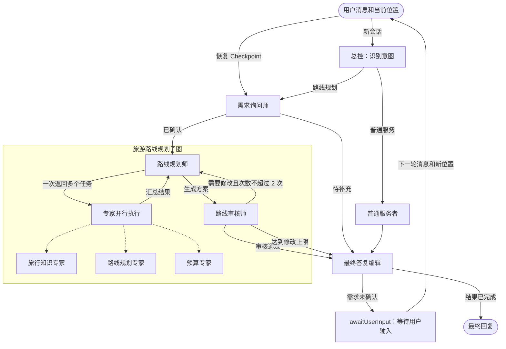
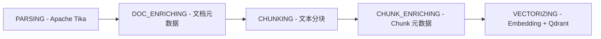

<div align="center">

# 行迹 AI 旅行助手

### 让每一次出发，都有一位懂目的地的 AI 向导

面向旅行场景的多智能体助手：通过自然语言完成旅行问答、需求澄清和个性化行程规划。

[](https://openjdk.org/)
[](https://spring.io/projects/spring-boot)
[](https://spring.io/projects/spring-ai)
[](https://react.dev/)
[](https://www.typescriptlang.org/)
[](https://www.mysql.com/)
[](https://redis.io/)
[](https://kafka.apache.org/)
[](https://vite.dev/)
[](https://developers.weixin.qq.com/miniprogram/dev/framework/)
[](LICENSE)

<a href="https://openjdk.org/"></a>

**Java 21** · **Spring Boot 4** · **Spring AI Alibaba** · **LangGraph4j**

[快速开始](#快速开始) · [系统架构](#系统架构) · [API 文档](#api-文档)

</div>

## 项目简介

行迹 AI 旅行助手面向旅行问答与路线规划，使用 LangGraph4j 编排状态驱动的多智能体协作，让不同专家共同完成需求澄清、行程规划、预算核算和结果审核。

- **多智能体意图路由**：由总控 Agent 识别用户意图并写入工作流状态；普通旅行问答直接进入普通服务链路，路线规划请求进入“需求确认—路线规划—路线审核—最终答复”流程，避免无关请求进入复杂规划链路。
- **语义缓存加速**：需求确认完成后，将结构化旅行需求写入 Redis Stack 的 HNSW 向量索引并进行相似度匹配，同时校验起点、终点、日期等必填条件；命中相近需求时复用历史路线方案，减少重复模型调用，且缓存仅在路线审核通过后写入并设置 24 小时 TTL。
- **旅行规划与审核回流**：路线规划师根据确认后的需求生成行程，路线审核师从需求匹配度、行程完整性和可执行性等维度输出结构化审核结果；审核不通过时将问题回流至规划师重新生成，领域规则限制最多两轮修订，形成受控的“规划—审核—修订”闭环。
- **RAG 检索与重排**：基于 Apache Tika 完成多格式文档解析、元数据提取和文本分块，使用 Qdrant 按相似度阈值召回候选 Chunk，再由 Qwen Rerank 对候选内容进行二次排序和截断；最终上下文同时保留正文、文档与 Chunk 元数据以及向量分数和重排分数，提升景点、城市和路线知识的召回准确性与可追溯性。
- **动态上下文注入与并发协作**：根据当前流程阶段组装需求、规划、审核等结构化上下文，避免每轮重复传递完整历史；路线规划师按需生成多个专家任务，对同一专家去重后通过 `CompletableFuture.allOf` 和自定义线程池并发调用旅行知识、路线和预算专家，再统一汇总结果，降低整体规划耗时。

## 系统架构


## 多智能体协作



| 角色 | 工具与职责 | 启用条件 |
| --- | --- | --- |
| 总控 | 判断路线规划或普通服务 | 始终启用 |
| 路线需求询问师 | 收集并确认路线规划需求 | 路线规划 |
| 路线规划师 | 制定行程，一次返回多个专家任务 | 路线规划 |
| 路线审核师 | 审核行程；最多要求修改两次 | 路线规划 |
| 普通服务者 | 直接处理非路线规划问题 | 普通服务 |
| 最终答复编辑 | 将已完成结果整理为面向用户的自然回复 | 始终启用 |
| 旅行知识规划专员 | 提供旅行知识与目的地建议 | 并行按需调用 |
| 路线规划专员 | 提供路线与行程安排建议 | 并行按需调用 |
| 预算专员 | 汇总已知门票、住宿、餐饮与交通费用；缺失价格标记待确认 | 并行按需调用 |

三位专家统一返回结构化 JSON，由路线规划子图的并行执行节点按需调度；未被选中的专家不会执行。提示词位于 `src/main/resources/prompt/`，统一使用“角色、输入、输出、约束”结构。

## RAG 知识库

RAG 模块独立于 LangGraph 编排层，负责知识文档的导入、加工、向量化、检索和运营管理。路线规划师与普通服务者通过 Spring AI Tool 按需调用旅行知识专家；Qdrant 召回候选 Chunk 后直接交由 Qwen Rerank 重排并筛选最终结果，最后将结构化知识上下文交给上层 Agent。

Redis 语义缓存与 Qdrant RAG 分工明确：Redis 只保存已审核的路线方案，利用内存查询和 TTL 快速复用相似需求；Qdrant 保存知识库 Chunk，支持较大规模的向量召回、过滤和持久化。两者不互相替代。

### RAG 检索设计优势

采用“向量召回 + 语义重排”的两阶段设计，可以先利用 Qdrant 快速筛出较大的候选集合，再由 Qwen Rerank 对候选内容进行精细相关性判断。这样既保留了向量检索的速度和扩展性，又能减少仅依赖向量距离带来的误召回，提升最终注入上下文的准确性。

召回和重排职责分离，便于独立替换存储或模型，也能根据数据规模和调用成本调整检索策略。结果同时保留正文、文档元数据、Chunk 元数据以及两阶段评分，方便生成答案和后续问题定位。

### RAG 文档导入流水线

导入接口只负责接收文件、保存任务和发送 Kafka 消息，不等待完整处理。Kafka 消费者使用固定顺序的节点流水线执行：



先解析文档，再补充文档元数据、切分文本、补充 Chunk 元数据，最后生成向量并写入 Qdrant。

这种设计让文件上传与耗时的解析、向量化解耦，接口可以快速返回，避免大文件处理阻塞请求。Kafka 提供任务缓冲和失败重试能力，固定顺序的节点也让每个阶段职责清晰、便于定位问题；任务状态和消息 outbox 持久化后，即使服务重启也能继续处理，降低数据丢失风险。

## 快速开始

Docker Compose 会启动管理台、API、MySQL、Redis、Qdrant 和单节点 Kafka（KRaft）。

```bash
git clone <仓库地址> travel-agent
cd travel-agent
cp .env.example .env
# 编辑 .env，填入必填配置
docker compose up -d --build
```

查看状态和日志：

```bash
docker compose ps
docker compose logs -f
```

管理台地址：`localhost:8081`，API 地址：`localhost:18080`。

更新部署：

```bash
git pull
docker compose up -d --build
```

数据由 Docker volumes 持久化；不要执行 `docker compose down -v`，否则会删除 MySQL、Kafka、Qdrant 和 Redis 数据。

## API 文档

后端启动后访问：

`localhost:18080/doc.html`


文档访问密码：`123456`

## 快速体验

[用户侧 Agent 网页端示例](http://agent.ndakjin.asia/)

[接口文档展示入口](http://admin.ndakjin.asia/doc.html)

## 开源协议

[MIT](LICENSE) · 联系方式：`ndakjin@qq.com`


