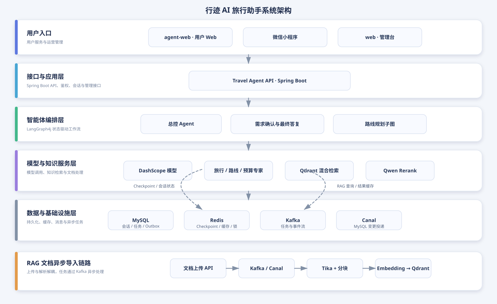
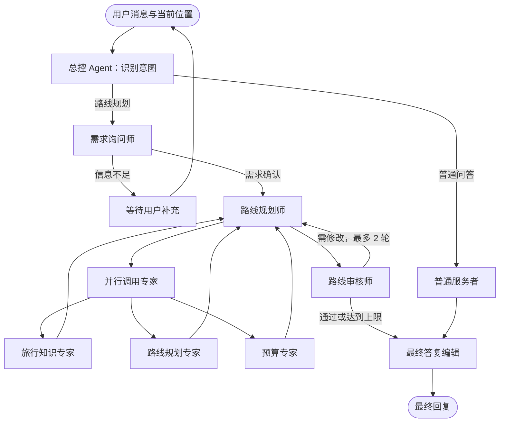
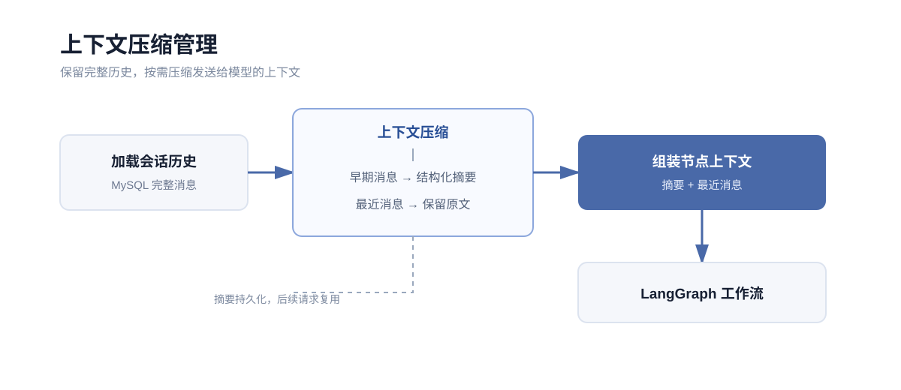
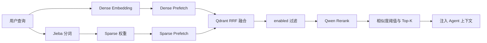
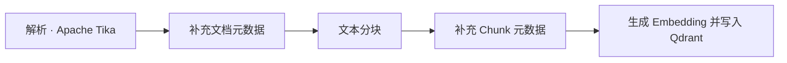

<div align="center">

# 行迹 AI 旅行助手

让每一次出发，都有一位懂目的地的 AI 向导

面向旅行场景的多智能体助手，通过自然语言完成旅行问答、需求澄清与个性化行程规划。

[](https://openjdk.org/)
[](https://spring.io/projects/spring-boot)
[](https://spring.io/projects/spring-ai)
[](https://react.dev/)
[](https://www.typescriptlang.org/)
[](https://www.mysql.com/)
[](https://redis.io/)
[](https://kafka.apache.org/)
[](https://vite.dev/)
[](https://developers.weixin.qq.com/miniprogram/dev/framework/)
[](LICENSE)

**Java 21** · **Spring Boot 4.0.0** · **Spring AI Alibaba 2.0.0-M1.1** · **LangGraph4j 1.8.24**

[快速开始](#快速开始) · [系统架构](#系统架构) · [API 文档](#api-文档)

</div>

## 项目简介

行迹将旅行问答、需求收集、知识检索和路线规划组织为一条可追踪的工作流。LangGraph4j 负责编排状态，多个领域 Agent 协同完成规划，并由审核 Agent 对结果进行校验。

### 核心能力

- **意图路由**：总控 Agent 区分普通问答与路线规划，只有规划请求才进入复杂工作流。
- **需求确认**：自动收集起点、目的地、日期、天数、人数、预算和偏好等关键信息。
- **多专家协作**：旅行知识、路线和预算专家并行执行，规划师汇总结果后生成行程。
- **规划审核闭环**：审核不通过时回流修改，最多修订两轮，确保结果可执行。
- **语义缓存**：Redis Stack 以相似需求复用已审核路线，默认 TTL 为 24 小时。
- **RAG 知识库**：Apache Tika 解析文档，Qdrant 混合检索，Qwen Rerank 二次排序。
- **上下文压缩**：MySQL 保存完整会话，模型侧按 token 预算使用摘要与近期消息。

## 快速体验

- [用户侧 Agent 网页端](http://agent.ndakjin.asia/)
- [接口文档展示入口](http://admin.ndakjin.asia/doc.html)

## 快速开始

### 使用 Docker Compose

Docker Compose 会启动管理台、API、MySQL、Redis、Qdrant 和单节点 Kafka（KRaft）。

```bash
git clone <仓库地址> travel-agent
cd travel-agent
cp .env.example .env
# 编辑 .env，填入模型、数据库等必填配置
docker compose up -d --build
```

更新部署：

```bash
git pull
docker compose up -d --build
```

数据通过 Docker volumes 持久化。除非确认要清空数据，否则不要执行 `docker compose down -v`。

## 系统架构




## 多智能体协作



## 上下文压缩管理

会话采用“完整原文 + 增量摘要 + 最近消息”的分层策略。MySQL 永久保存原始消息，模型请求根据 token 预算加载摘要和近期对话，并为系统提示词、工具调用、RAG 结果和模型输出预留空间。



当前代码已落地 token 预算裁剪，摘要持久化链路待继续接入。不同节点按需接收上下文：监督和需求收集使用摘要与近期对话，规划和审核主要使用结构化需求、路线方案及审核结果。

## 语义缓存

路线规划会经过需求确认、知识检索、专家协作和审核等多个阶段。需求确认完成后，系统将结构化需求写入 Redis Stack 的 HNSW 索引，按相似度召回历史路线，并校验起点、终点、日期、天数、人数和预算等条件。

- 命中：直接复用已审核的路线方案，降低延迟和模型调用成本。
- 未命中：执行完整规划流程。
- 写入条件：仅审核通过的结果会进入缓存。
- 有效期：默认 24 小时，避免长期复用过时的价格和景点信息。

语义缓存只用于路线规划，不缓存普通闲聊、知识问答或未通过审核的方案。

## RAG 知识库

RAG 模块独立于 LangGraph 编排层，负责文档导入、加工、向量化、检索和运营。Redis 负责路线方案缓存，Qdrant 负责知识库 Chunk 的持久化与向量检索，两者职责互不替代。

### 混合检索



- **Dense**：DashScope Embedding + Cosine 相似度，擅长识别同义表达。
- **Sparse**：Jieba 分词与轻量 token hash，提供中文词法匹配；更换 tokenizer 后需重建索引。
- **RRF**：分别召回 dense/sparse 候选，再按排名融合，避免分数尺度差异。
- **Rerank**：Qwen 对查询与候选 Chunk 二次排序，`similarity-threshold` 作用于 rerank score。

检索结果会保留正文、文档和 Chunk 元数据，以及 dense、sparse、RRF 和 rerank 分数，便于追溯。RAG 工具结果使用 Redis 精确缓存，默认 TTL 为 2 分钟，可通过 `TRAVEL_AGENT_RAG_CACHE_TTL` 调整。

### 文档导入流水线

导入接口只负责接收文件、创建任务并发送 Kafka 消息；消费者按固定顺序异步处理：



异步流水线将文件上传与耗时处理解耦，Kafka 提供任务缓冲和失败重试，任务状态与 outbox 持久化后可在服务重启时继续处理。

## API 文档

后端启动后访问：<http://localhost:18080/doc.html>

文档访问密码：`123456`

## 目录结构

```text
src/          后端服务与 LangGraph 工作流
fe/           React 管理台
agent-web/    用户侧 Web 端
miniprogram/  微信小程序
docs/         架构与项目文档
assets/       README 配图
compose.yaml  本地/测试环境编排
```

## 开源协议

[MIT](LICENSE) · 联系方式：`ndakjin@qq.com`
